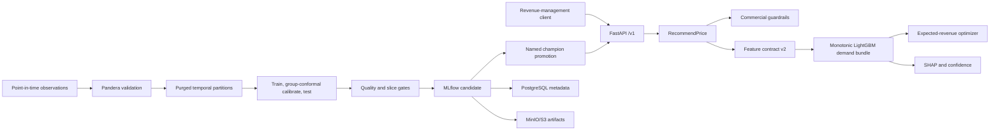

# Pricing Recommendation Engine

[](https://github.com/Miguesh/pricing-recommendation-engine-/actions/workflows/ci.yml)
[](https://www.python.org/)
[](LICENSE)

A production-oriented dynamic-pricing recommendation service for nightly
rentals. It estimates occupancy over a policy-constrained price grid and returns
the price that maximizes expected nightly revenue, together with calibrated
uncertainty, confidence, SHAP drivers, global importance, and model lineage.

> **Project status:** pre-1.0 reference implementation. The software path is
> tested with deterministic synthetic data; the repository does not claim
> real-world revenue uplift or production deployment evidence.

## Why this is not a price-regression demo

Historical prices are decisions made by an earlier policy, not optimal labels.
Regressing directly to them would reproduce that policy and its bias. This
engine learns observational demand response instead:

```text
expected_occupancy = f(candidate_price, point_in_time_context)
expected_revenue   = candidate_price × expected_occupancy
```

It then maximizes expected revenue subject to explicit floors, ceilings,
increments, maximum-change limits, and an optional occupancy floor. This is a
more defensible decision architecture, while still acknowledging that
observational data does not identify causal price elasticity.

## What makes the system production-oriented

| Concern | Implementation |
| --- | --- |
| Point-in-time correctness | Mandatory `as_of_date` and `outcome_available_date`, duplicate-snapshot checks, purged chronological partitions, optional embargo |
| Economic consistency | Negative monotonic constraints on price signals and deterministic lower-price tie-breaking |
| Uncertainty | Quantile tails with group-conformal calibration, simultaneous stay-level coverage, and quantile-order repair |
| Explainability | Cached local SHAP explanations plus normalized global importance; readiness fails closed if SHAP warm-up fails |
| Model risk | Equal-stay-weighted fitting/evaluation plus aggregate, revenue, calibration, required-slice, policy-grid, and same-holdout challenger/champion gates |
| Reproducibility | `uv.lock`, clean-wheel CI, supported-Python matrix, explicitly versioned container bases |
| Lifecycle | MLflow candidates, dataset fingerprints, semantic feature hashes, SHA-256 artifact integrity, immutable tenant/currency binding, explicit promotion and rollback |
| Serving | FastAPI contracts, single-tenant routing, liveness/readiness split, body-read deadline, bulkhead, soft inference deadline, request IDs, Prometheus metrics |
| Container security | Non-root API/MLflow users, dropped capabilities, read-only filesystems, bounded Uvicorn settings |

## Architecture



The source follows Clean Architecture:

```text
src/pricing_engine/
├── domain/          # Immutable business models, constraints, pricing policy
├── application/     # Recommendation, training, evaluation, retraining, ports
├── infrastructure/  # Features, Pandera, LightGBM, MLflow, drift, demo data
└── interfaces/      # FastAPI and CLI delivery adapters
```

Domain code does not depend on FastAPI, Pandas, LightGBM, or MLflow. Training is
an offline workflow and is never exposed as an API endpoint.

## Model design

The demand bundle contains:

- lower and upper LightGBM quantile models with 100 trees each;
- a 400-tree central L2 regression model with negative monotonic constraints on
  `candidate_price` and `price_to_competitor_ratio`;
- stay-group conformal interval calibration on a held-out chronological window;
- feature-distribution support statistics; and
- a lazily initialized, cached SHAP explainer.

Every training snapshot receives weight
`1 / snapshots_for_(tenant_id, property_id, stay_date)`. The lower, central, and
upper boosters all fit with those weights, so a frequently snapshotted stay has
the same total fitting influence as a stay observed once.

The central objective is L2 because LightGBM rejects monotonic constraints with
its L1 regression objective. Independently trained tails can cross, so inference
repairs the order around the central estimate before constructing domain
objects.

Feature contract `2.0.0` covers price, lead time, recent occupancy, booking
pace, competitor price, property capacity and review score, event/holiday
context, cyclic seasonality, and optional paired latitude/longitude.
The ordered feature manifest includes data types, units, derivation semantics,
and missing-value behavior. Its SHA-256 semantic hash is serialized with the
bundle and checked at promotion and API startup; matching column names alone are
not sufficient.

Every bundle is trained for exactly one normalized `tenant_id` and one currency.
The registered-model namespace is immutably bound to that tenant/currency pair;
use a separately trained and registered model, deployment, and authenticated
routing boundary for every other tenant or currency.

## Quick start

Prerequisites: Python 3.11–3.13 and
[`uv`](https://docs.astral.sh/uv/). Docker Desktop is needed only for the full
integration platform.

PowerShell:

```powershell
Copy-Item .env.example .env
uv sync --locked --extra dev --python 3.12
uv run pricing-engine generate-demo-data `
  --output data/demo/observations.parquet
uv run pricing-engine train `
  --input data/demo/observations.parquet `
  --output artifacts/local-model
```

Set the bundle in `.env`:

```dotenv
PRICING_MODEL_URI=artifacts/local-model
```

Start the API:

```powershell
uv run uvicorn pricing_engine.interfaces.api.app:create_app `
  --factory --reload --port 8000
```

Open `http://localhost:8000/docs`. Liveness is available at
`/health/live`; `/health/ready` returns 503 until a model is loaded.

## API example

`POST /v1/pricing/recommendations` accepts one property/stay-date decision. If
`PRICING_API_KEY` is configured, also send `X-API-Key`.

```json
{
  "tenant_id": "demo-tenant",
  "property_id": "property-a",
  "stay_date": "2026-08-15",
  "as_of_date": "2026-07-18",
  "currency": "USD",
  "current_price": "125.00",
  "historical_occupancy_7d": 0.72,
  "booking_pace_7d": 0.35,
  "competitor_price_median": "130.00",
  "bedrooms": 2,
  "accommodates": 4,
  "review_score": 4.7,
  "is_holiday": false,
  "event_intensity": 1.0,
  "latitude": 25.7617,
  "longitude": -80.1918,
  "constraints": {
    "min_price": "90.00",
    "max_price": "170.00",
    "price_increment": "5.00",
    "max_price_change_pct": "0.20",
    "min_expected_occupancy": 0.20
  }
}
```

Selected fields from a representative response for the deterministic synthetic
baseline described below are shown here. `model_version` is generated by each
training run and is intentionally not hard-coded:

```json
{
  "recommended_price": "130.00",
  "currency": "USD",
  "expected_occupancy": 0.8053,
  "expected_occupancy_interval": [0.7067, 0.8395],
  "confidence_score": 80.1,
  "confidence_method": "Calibrated occupancy-interval width combined with feature-space in-distribution support; it is not a booking probability.",
  "expected_revenue": "104.68",
  "model_version": "<runtime-generated-model-version>"
}
```

The complete response also contains the explanation, local SHAP contributions,
global importance, and applied constraints. The confidence score is not a
booking probability. SHAP explains the selected central-demand prediction and
does not establish causality; the API does not serve if SHAP initialization or
explanation warm-up fails.

Request-body receipt has its own deadline
(`PRICING_REQUEST_BODY_TIMEOUT_SECONDS`, default five seconds) and returns 408
when the recommendation body is not received in time. This is separate from the
soft inference deadline (`PRICING_REQUEST_TIMEOUT_SECONDS`): a 504 response does
not forcibly cancel already-running native work.

## Transparent synthetic baseline

The following deterministic result uses
`generate-demo-data --properties 12 --decision-days 180 --seed 42`, 400 central
trees, 100 trees for each quantile tail, and the versioned training pipeline:

| Evidence | Synthetic result |
| --- | ---: |
| Observations | 2,160 |
| Train / calibration / test rows after purge | 1,416 / 218 / 253 |
| Purged train / calibration rows | 130 / 143 |
| Occupancy MAE | 0.0214351 |
| Occupancy RMSE | 0.0299894 |
| Occupancy R² | 0.9308273 |
| Simultaneous stay-group interval coverage | 0.9169960 |
| Mean interval width | 0.2014993 |
| Revenue-at-historical-price WAPE | 0.0284972 |
| Mean controlled price response | 0.1944230 |
| Flat price-response rate | 0.0039526 |
| Upper / any policy-boundary rate | 0.0553360 / 0.0553360 |
| Lower policy-boundary rate | 0.0000000 |
| Mean selected price change | -0.0063241 |
| Holiday/no: rows, coverage, MAE, WAPE | 168 / 0.93452 / 0.01880 / 0.02457 |
| Holiday/yes: rows, coverage, MAE, WAPE | 85 / 0.88235 / 0.02664 / 0.03537 |

These numbers are deliberately labeled synthetic. The generator embeds a
controlled relationship that resembles the model assumptions, so this result
demonstrates software integration and metric plumbing—not generalization,
causal validity, market readiness, or expected business lift. In particular,
revenue-at-historical-price WAPE is a predictive diagnostic, not causal policy
uplift or off-policy evaluation (OPE).

## MLflow lifecycle

The local integration platform provides PostgreSQL metadata, MinIO artifacts,
MLflow, and the API:

```powershell
docker compose config --quiet
docker compose --env-file .env up --build --detach
```

Compose uses MLflow's artifact proxy, so host commands and the API do not need
MinIO credentials. A remotely tracked legacy experiment whose artifact root is
direct `s3://`/cloud storage is rejected; migrate it or use a new proxied
experiment and an appropriately bound registered-model namespace.

Create a candidate from the host:

```powershell
uv run pricing-engine retrain `
  --input data/demo/observations.parquet `
  --experiment-name pricing-demand `
  --registered-model-name pricing-demand
```

After reviewing the run in `http://localhost:5000`, promote a specific version:

```powershell
uv run pricing-engine promote `
  --version <MODEL_VERSION> `
  --approved-by "Miguel Angel Sierra Hayer" `
  --registered-model-name pricing-demand
```

Then configure and recreate the API:

```dotenv
PRICING_MODEL_URI=models:/pricing-demand@champion
```

Production configuration accepts only the governed
`models:/<registered-model-name>@champion` form. Local paths and specific model
versions are development/diagnostic sources only. Startup does not trust the
alias name by itself: it revalidates the finished run, passed gate, named
approval, deployment decision, tenant/currency binding, feature contract, and
matching run/version checksum before downloading an immutable model version.

```powershell
docker compose up --detach --force-recreate api
Invoke-RestMethod http://localhost:8000/health/ready
```

When a compatible champion exists, retraining loads it and evaluates both
models on the candidate's same immutable current holdout before applying
non-regression gates and registering the candidate. Retraining can register but
cannot promote. Promotion requires a `FINISHED` MLflow run, consistent run/model
governance evidence, a verified SHA-256 bundle checksum, and benchmark evidence
for the still-current champion; a candidate becomes stale if that alias changes
and must be retrained/re-evaluated. Rollback is a separate audited command that
restores an eligible superseded version. Use the same configurable model name
for `retrain`, `promote`, `rollback`, and `PRICING_MODEL_URI`. Promotion and
rollback must have a single writer per namespace because the implementation
does not provide a distributed lock or compare-and-swap around alias changes.
See [the runbook](docs/runbook.md) for the complete procedure and validation
boundary.

## Quality gates

```powershell
uv lock --check
uv run ruff check .
uv run ruff format --check .
uv run mypy src
uv pip check
uv run pytest --cov=pricing_engine --cov-report=term-missing --cov-report=xml
uv build --no-sources
docker compose config --quiet
```

CI additionally:

- tests Python 3.11, 3.12, and 3.13;
- enforces the 85% branch-aware coverage threshold;
- runs Ruff security rules and strict MyPy;
- builds both source and wheel distributions;
- clean-installs the wheel and imports production entry points;
- builds and smoke-tests the API and MLflow images without external secrets;
  and
- runs a real Docker E2E path that generates data, retrains and registers a
  candidate, promotes it, starts the champion API, issues a recommendation, and
  verifies the MLflow artifact proxy, checksum, tenant/currency binding, alias,
  and untrusted-host rejection.

## Repository map

| Path | Purpose |
| --- | --- |
| `src/pricing_engine/domain` | Business invariants and constrained price selection |
| `src/pricing_engine/application` | Inference, training, evaluation, retraining, ports |
| `src/pricing_engine/infrastructure` | Data contracts, features, model, registry, monitoring |
| `src/pricing_engine/interfaces` | REST API and CLI adapters |
| `tests` | Domain, contract, model, API, registry, CLI, drift, and retraining tests |
| `docs/architecture.md` | System design and dependency boundaries |
| `docs/model-card.md` | Intended use, evaluation, uncertainty, and model risk |
| `docs/runbook.md` | Local operation, promotion, monitoring, and rollback |
| `docs/adr` | Consequential architecture decisions |
| `docker-compose.yml` | Local API, MLflow, PostgreSQL, and MinIO platform |

## Known limitations and next evidence required

- Real-market quality has not been evaluated in this repository.
- The coherent synthetic demo is integration evidence, not causal proof.
- Real data and multi-year rolling backtests across market regimes are still
  required; the single deterministic holdout is not sufficient evidence.
- Observational training cannot by itself prove causal price elasticity.
- Coordinates are an initial location signal, not a complete market ontology.
- Cold start, delayed-outcome calibration, and low-confidence fallback policy
  require deployment-specific evidence.
- Enterprise production requires external identity, tenant-bound authorization,
  managed secrets, TLS, rate limiting, audit storage, orchestration, backups,
  and market-level monitoring.
- Compose credentials and `.env` secrets are local-development conveniences,
  not production secret management.
- Revenue uplift must be established with controlled experiments or defensible
  causal/off-policy evaluation before automated rollout.

## Documentation and governance

- [Architecture](docs/architecture.md)
- [Model card](docs/model-card.md)
- [Operations runbook](docs/runbook.md)
- [ADR 001: demand-response optimization](docs/adr/001-demand-response-optimization.md)
- [Contributing](CONTRIBUTING.md)
- [Security policy](SECURITY.md)

Licensed under the [MIT License](LICENSE).
