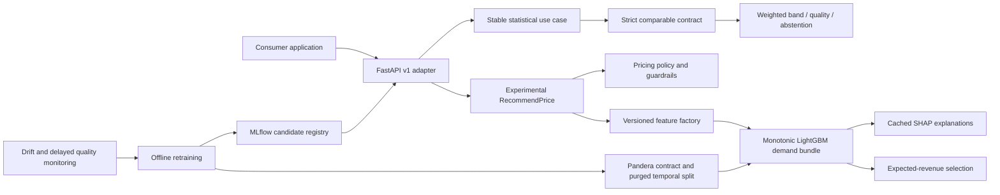
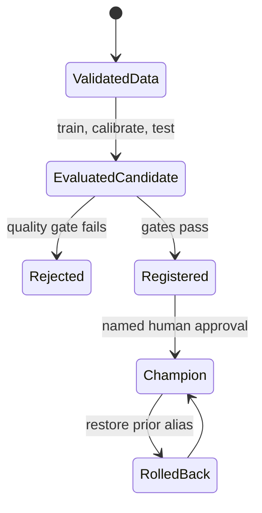

# Architecture

## Profile boundary

This service exposes two explicit pricing profiles with different evidence and
runtime requirements.

- `MARKET_EVIDENCE_STATISTICAL_V1` is the default stable contract. It describes
  an authorized consumer-selected comparable set with weighted P25/P50/P75,
  evidence components, and typed abstention. It is pure, deterministic, and
  loads no model or external service.
- `PERFORMANCE_AWARE_EXPERIMENTAL` is the preserved constrained demand-and-
  revenue optimizer. It is not a regression that imitates historic prices and
  requires operational features plus a governed trained artifact.

Historic prices are previous policy decisions, not optimal labels. For the
experimental profile, the target grain is one pricing snapshot per tenant,
property, stay date, and as-of date.

```text
expected_revenue = candidate_price × expected_occupancy
```

Every feature must have been observable at `as_of_date`. Every supervised label
also carries `outcome_available_date`; a row can enter a partition only if its
outcome was strictly available before the next decision window, less any
configured embargo. These contracts are the primary defenses against future
information leakage.

## Component view



## Clean Architecture

| Layer | Responsibility | Must not depend on |
| --- | --- | --- |
| `domain` | Value objects, statistical contracts, commercial constraints, selection policy | FastAPI, Pandas, MLflow, LightGBM |
| `application` | Statistical recommendation, experimental recommendation, training, evaluation, retraining, ports | HTTP delivery and storage details |
| `infrastructure` | Feature engineering, LightGBM, Pandera, MLflow, drift | Route handlers |
| `interfaces` | FastAPI, CLI, health and telemetry adapters | Concrete training orchestration |

Training is not exposed through HTTP. The stable statistical service starts
without any artifact. The experimental service starts only from a portable
local bundle or a configured MLflow model URI. Dependency direction points
inward: infrastructure implements application ports, while domain rules remain
pure.
Experimental startup is optional for the co-hosted process: its predictor and
service are published only after load, contract validation, prediction/SHAP
warm-up, and service construction all succeed. An ordinary failure clears that
partial state and leaves the stable profile operational.
The principal ports isolate training-data validation, feature construction,
model fitting/prediction, candidate registration, and model loading from their
Pandera, Pandas, LightGBM, filesystem, and MLflow adapters.

## Stable statistical decision flow

PLUSBNB or another consumer owns source authorization, normalization,
comparable selection, similarity scoring, and human review. The engine receives
only opaque identifiers, bounded property context, compatible total nightly
rates, similarity scores/factors, and lineage references.

For each request, the stable profile:

1. enforces contract, currency, timezone, stay, guest, point-in-time, usability,
   comparable/observation uniqueness, and exact lineage tuple coverage;
2. applies versioned 90-day and minimum-individual-similarity eligibility;
3. preserves and excludes weighted Tukey price outliers;
4. normalizes similarity weights and checks count, effective sample size,
   average similarity, and dispersion gates;
5. calculates left-continuous weighted empirical P25/P50/P75 with `Decimal`;
6. selects P25, P50, or P75 for conservative, balanced, or premium strategy;
7. reports evidence components and an ordinal quality class; and
8. returns a typed abstention instead of a silent fallback when gates fail.

Contract, algorithm configuration, evidence, and outlier policies have separate
version identifiers. Canonical JSON hashing plus UUIDv5 creates reproducible run
identity. The calculation performs no I/O, network call, MLflow lookup, model
load, forecast, or currency conversion. See the
[statistical ADR](architecture/ADR-market-evidence-statistical-v1.md) and
[algorithm specification](algorithms/WEIGHTED_PERCENTILE_V1.md).

## Experimental model and decision flow

The bundle fits three LightGBM models:

- a 100-tree lower quantile model;
- a 400-tree central L2 regression model with negative monotonic constraints on
  candidate price and price-to-competitor ratio;
- a 100-tree upper quantile model.

LightGBM does not support monotonic constraints with its L1 regression
objective, which is why the central curve uses L2. Quantile tails remain
independent, then stay-group conformal calibration expands their interval on a
chronological holdout. Inference repairs any residual quantile crossing around
the central estimate, guaranteeing `lower ≤ expected ≤ upper` in `[0, 1]`.

Before fitting, every row receives weight
`1 / snapshots_for_(tenant_id, property_id, stay_date)`. All three LightGBM
boosters consume the same weights, giving each stay equal total influence even
when its point-in-time snapshot count differs.

For each request, the engine:

1. intersects absolute price bounds with the maximum-change policy;
2. creates an increment-aligned candidate grid;
3. builds the same feature contract used during training;
4. predicts occupancy and uncertainty for every candidate;
5. removes candidates below an optional occupancy floor;
6. maximizes expected nightly revenue; and
7. breaks exact ties in favor of the lower price.

The confidence score combines calibrated interval width and feature-space
support. It is an operational reliability indicator, not booking probability or
causal certainty. SHAP explains central demand at the selected price; global
LightGBM importance gives portfolio-level context. SHAP is a required
experimental serving capability: startup warms prediction and explanation, and
the experimental path fails closed if artifact loading, contract validation,
native initialization, explanation warm-up, or service construction fails. It
does not fall back to the stable calculation.

## Feature and data contract

Feature contract `2.0.0` includes price, lead time, recent occupancy, booking
pace, competitor price, property capacity and quality, holiday/event context,
cyclical calendar signals, and optional latitude/longitude. Coordinates must be
provided as a pair. A `location_known` indicator distinguishes missing
coordinates from the neutral numeric sentinel used by the tabular matrix.

The contract is not just an ordered column list. A semantic manifest records
each feature's type, unit, derivation, and missing-value behavior, and a SHA-256
hash covers the version, order, and manifest. Training serializes the version
and hash; champion comparison, promotion, and API startup reject mismatches.

Pandera validates offline observations before splitting or fitting. The
contract rejects malformed ranges, duplicate decision snapshots, negative lead
time, invalid coordinate pairs, inconsistent stay outcomes, and rows that
violate point-in-time semantics. Realized occupancy is a target only and never
an inference feature. A model accepts exactly one normalized tenant and one
currency.

The splitter orders unique `as_of_date` values, forms chronological train,
calibration, and final-test windows, purges train/calibration rows whose
`outcome_available_date` crosses the next boundary, and can add a fixed embargo.
The same `(tenant_id, property_id, stay_date)` group cannot cross partitions.
No random split is permitted. Calibration reduces each stay group to its worst
nonconformity residual; evaluation gives each stay equal total weight and
reports simultaneous group coverage, which counts a stay as covered only when
all its snapshots are covered.

## Evaluation and promotion

Offline evaluation separates demand quality from commercial error:

- occupancy MAE, RMSE, and R²;
- simultaneous stay-group conformal coverage and equal-stay-weighted mean width;
- expected-revenue MAE and WAPE at historical observed prices;
- slice metrics for operationally important cohorts;
- minimum temporal test size;
- controlled price-response and policy-boundary behavior on the canonical
  `0.65, 0.70, ..., 1.35` historical-price multiplier grid; and
- challenger-versus-champion non-regression on the exact same immutable current
  holdout when the champion has compatible tenant, currency, feature version,
  and semantic hash.

Slice evidence includes predictive metrics and the economic-grid diagnostics
(response, flatness, upper/lower/any boundary saturation, and mean selected
change). Lead-time, holiday, event, and location slices are required when
applying promotion gates; in particular both `holiday/yes` and `holiday/no`
must have sufficient independent evidence and pass their slice gates.

Revenue error at historic prices is not evidence that the recommended policy
creates uplift. It is a weighted demand-error diagnostic. Causal uplift requires
controlled experiments or defensible off-policy evaluation (OPE). The coherent
synthetic generator is useful integration evidence but is not causal proof.

The serving policy separately intersects absolute min/max bounds with the
request's maximum-change guardrail, aligns to the increment, and enforces a
candidate-count budget. The public contract hard-rejects
`max_price_change_pct > 0.35`; the offline policy gate exercises the full ±35%
canonical grid rather than a narrow local probe.

## Model lifecycle



Candidate registration retains model parameters, metrics, feature version and
semantic hash, dataset fingerprint, model signature, input example, dependency
contract, and the complete portable bundle. It also computes a SHA-256 over the
serialized joblib bundle, records matching authoritative evidence in the run
parameters and model-version tags, and packages a checksum sidecar into the
PyFunc artifact. The PyFunc loader verifies that sidecar before `joblib.load`;
governed registry loading resolves the expected checksum from the model version
and verifies the downloaded bundle before deserialization. The registered-model
namespace is created with an immutable single-tenant/currency binding; later
candidates must match it. When a champion exists, retraining loads and evaluates
it on the new candidate's holdout, then logs candidate, benchmark, and delta
metrics.
Retraining never changes the `champion` alias. Promotion and rollback are
separate named-human decisions that revalidate gates, artifact metadata, and
binding before changing the alias.

Promotion additionally requires the candidate run to be `FINISHED`, requires
run and version checksum/benchmark evidence to agree, and rejects stale
comparison evidence if `champion` changed after candidate registration. That
candidate must be retrained and reevaluated against the new current champion.

Alias mutation is intentionally last and failures attempt compensating repair,
but promotion is not a distributed transaction. There is no lock or
compare-and-swap across concurrent operators, so each registered-model
namespace requires a single serialized promotion/rollback writer.

## Deployment and trust boundaries

- Liveness is independent of model availability. Default readiness succeeds
  when the stable artifact-free statistical profile is available. The explicit
  `?profile=PERFORMANCE_AWARE_EXPERIMENTAL` readiness check returns 503 until a
  compatible model has loaded and prediction/SHAP warm-up succeeds. Health
  fields report which profile was checked and experimental model availability.
  Optional-profile initialization internally distinguishes `NOT_CONFIGURED`,
  `READY`, and `UNAVAILABLE`; no partially initialized predictor or service is
  exposed.
- Statistical identifier fields and tenant bindings trim surrounding whitespace
  and share the 1-128 character grammar
  `^[A-Za-z0-9][A-Za-z0-9._:-]*$`. The legacy experimental request retains its
  separate 100-character wire contract.
- The statistical CLI reads no more than the 1,048,576-byte contract maximum
  plus one byte in binary mode, rejects oversize input before strict UTF-8
  decoding, and redacts malformed encoding, JSON, schema, and read errors.
- Production configuration accepts only a governed
  `models:/<registered-model-name>@champion` URI. Local paths and direct model
  versions remain development/diagnostic options, not production serving
  sources.
- Recommendation work is protected by a per-process semaphore (default four)
  and a soft inference deadline (default five seconds). Capacity wait expiry
  returns 503; inference deadline expiry returns 504. Timed-out synchronous work
  is not forcibly cancelled and retains its semaphore permit until it actually
  completes. A separate body-read deadline
  (`PRICING_REQUEST_BODY_TIMEOUT_SECONDS`, default five seconds) applies to the
  recommendation request stream and returns 408 before inference if receipt
  times out.
- The Docker API runs one Uvicorn worker. Additional workers duplicate the
  model, SHAP state, memory, and per-process concurrency allowance. Horizontal
  replicas need capacity planning, tenant-correct routing, independent
  readiness, and coordinated rolling recreation after champion changes; the
  alias is loaded at startup, not hot-reloaded.
- The API and MLflow Compose containers run as non-root with dropped
  capabilities and read-only filesystems; writable temporary space is explicit.
- Compose pins container versions and is intended only for local integration.
- Compose routes host/API artifact operations through MLflow's artifact proxy;
  only the MLflow service receives MinIO credentials. An older experiment with
  a direct `s3://` (or other cloud-store) artifact root is rejected for remote
  tracking and must be migrated or replaced with a newly proxied experiment
  and appropriately bound registered-model namespace.
- MLflow's `/health` endpoint remains available for container health checks and
  is exempt from MLflow host filtering. MLflow API routes reject an untrusted
  `Host` with 403; health success must not be interpreted as API-host
  authorization.
- API-key authentication is a local baseline, not enterprise identity.
- Production identity must bind an authenticated principal to `tenant_id`.
- Secrets must come from a secret manager and must never be logged or committed.
- `.env`, Compose database passwords, and MinIO credentials are local examples,
  not production secret-management patterns.
- Serialized model artifacts can execute code when loaded. Registry write
  access is therefore equivalent to code-deployment access.
- PostgreSQL, object storage, and MLflow must remain on private networks with
  access control, TLS, backup, and retention policies.

CI exercises the actual Docker integration path: image build, synthetic data
generation inside the API image, candidate registration through proxied MLflow,
explicit promotion, champion API startup, recommendation, and assertions over
artifact proxy location, checksum, tenant/currency binding, alias, and
untrusted-host rejection. This is software E2E evidence, not real-market model
or causal-policy evidence.

See `docs/contracts/PRICING_CONTRACT_V1.md` for the stable statistical contract,
`docs/model-card.md` for experimental model risk, and `docs/runbook.md` for
reproducible model-backed operation.
